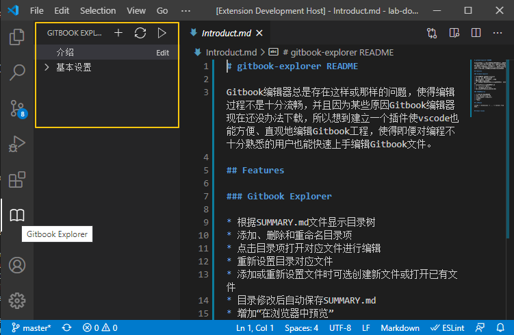

# gitbook-explorer README

Gitbook编辑器总是存在这样或那样的问题，使得编辑过程不是十分流畅，并且因为某些原因Gitbook编辑器现在还没办法下载，所以想到建立一个插件使vscode也能方便、直观地编辑Gitbook工程，使得即便对编程不十分熟悉的用户也能快速上手编辑Gitbook文件。

## Features

### Gitbook Explorer

* 根据SUMMARY.md文件显示目录树
* 添加、删除和重命名目录项
* 点击目录项打开对应文件进行编辑
* 重新设置目录对应文件
* 添加或重新设置文件时可选创建新文件或打开已有文件
* 目录修改后自动保存SUMMARY.md
* 增加“在浏览器中预览”
* 增加"Gitbook Serve"Task
* 拖动目录项改变目录结构(待完成)

### 编辑快捷菜单

* 格式化：H1-H6、列表项
* 插入: 引用、公式、图片
* 显示markdown基本语法帮助
* 显示预览
* 图片上传

## 安装方法

vscode -> Extensions -> ... -> Install from VSIX...

## Known Issues

